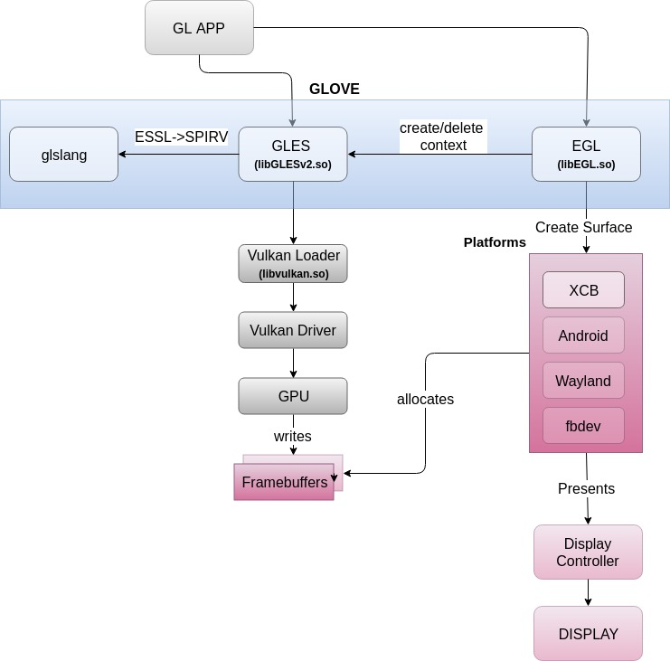
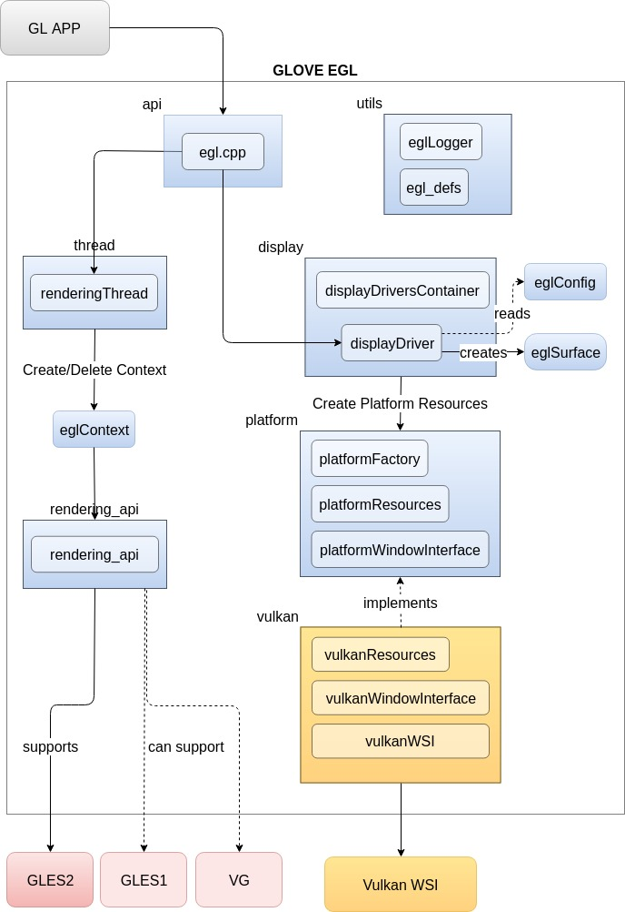
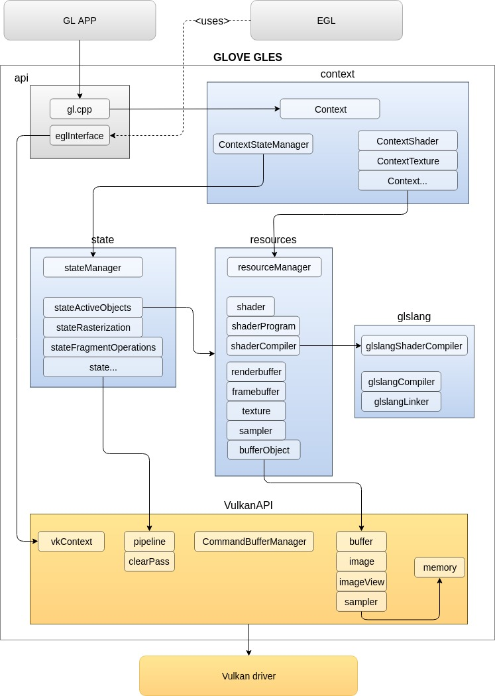

# 1 GLOVE Components

## 1.1 Introduction

 

**Figure 1:** _GLOVE functionality_

GLOVE (GLOverVulkan) is a software library that acts as a bridge between an OpenGL ES application and a Vulkan GPU driver. GLOVE receives OpenGL ES / EGL calls &amp; ESSL shaders sources from an OpenGL application, it translates them at runtime to Vulkan commands &amp; SPIR-V shader sources respectively and finally relays them to the underlying Vulkan driver (see figure 1).


## 1.2 GLOVE system architecture

 

**Figure 2:** _GLOVE components in a system_


To accomplish the above functionality, GLOVE offers implementations of OpenGL ES and EGL (see Figure 2) and is comprised of two shared libraries: libGLESv2.so and libEGL.so. Additionally, the translation from ESSL shaders to SPIR-V (needed by Vulkan) is handled by the external [glslang](https://github.com/KhronosGroup/glslang) library. The latter is statically linked to libGLESv2.so.

Currently, GLOVE supports [OpenGL ES 2.0](https://www.khronos.org/registry/OpenGL/specs/es/2.0/es_full_spec_2.0.pdf) and [EGL 1.4](https://www.khronos.org/registry/EGL/specs/eglspec.1.4.pdf) versions and has been tested with mesa Vulkan Intel driver, version **1.0.54** (see specification [here](https://www.khronos.org/registry/vulkan/)).

As a prerequisite for correct functioning, GLOVE must be linked to a Vulkan driver implementation which supports **VK\_KHR\_maintenance1** extension, mandatory for OpenGL to Vulkan Coordinates conversion (left handed to right handed coordinate system).


GLOVE EGL implementation can be connected to one or more window platforms such as XCB, Wayland, Android or fbdev, which handle framebuffer allocation / deallocation and presentation onto the system&#39;s display. Currently EGL supports XCB back-end, but it can be easily extended to support more back-ends (more details in [section 2.1.2](#2-1-2-egl-back-end-platform-support-))

## 1.3 GLOVE EGL

 

**Figure 3:** _GLOVE EGL components_

GLOVE EGL implementation is comprised of 2 parts:

1. **Rendering Thread:** This part implements rendering thread calls such as _eglBindAPI_, _eglQueryAPI_, _eglCreateContext_, etc.  It connects EGL to client APIs and maintains rendering contexts. Currently, GLOVE supports connection to OpenGL ES 2.0 only, but it already hosts hooks enabling to connect to other APIs (see [section 2.1.1](#2-1-1-egl-front-end-client-api-))
2. **Display Driver:** This part is responsible of creating and maintaining rendering surfaces as well as connecting to a window platform like XCB or Wayland. Platform part is implemented with abstract classes (platformWindowInterface, platformResources) that can be extended to support any desired platform (more details in [section 2.1.2](#2-1-2-egl-back-end-platform-support-)). Currently, GLOVE EGL implements connections to Vulkan WSI using XCB and native rendering (useful on embedded platforms) through the **VK\_KHR\_xcb\_surface** and **VK\_KHR_display** extensions, respectively.

EGL folder structure conforms to the above diagram (Figure 3).

## 1.4 GLOVE GLES

 

**Figure 4:** _GLOVE GLES2 components_

GLOVE GLES implementation is split into 3 main layers:

1. **API &amp; Context:** This layer implements all OpenGL ES calls within the scope of a rendering context. According to the user input it triggers either GL State or GL Resources modules.
2. **GL State &amp; Resources:** GL State module is responsible of maintaining the GL state of a rendering context (e.g., activeTexture, activeProgram, CullFace, FrontFace, PolygonOffset). Resources module tracks the resources of a rendering context such as textures, shaders, framebuffers and vertex buffers. Shader &amp; ShaderProgram modules use glslang modules to compile &amp; link shaders, transforming ESSL sources to SPIR-V.
3. **Vulkan API:** This layer provides the interface to the Vulkan driver, by creating and maintaining all Vulkan Objects needed to construct and use a rendering pipeline through a Vulkan GPU driver.

GLES folder structure conforms to the above diagram (Figure 4).

# 2 How to Extend GLOVE

## 2.1 EGL Hooks

### 2.1.1 EGL Front-end (Client API)

GLOVE EGL can be connected to OpenGL ES or OpenVG client APIs at run-time using the **dlopen** system call. The interface to client APIs is provided via a set of callback functions used in EGLContext scope. The client API callbacks are defined in the header file: **EGL/include/rendering\_api\_interface.h**.

```cpp
typedef struct rendering_api_interface {
    api_state_t state;
    init_API_cb_t init_API_cb;
    terminate_API_cb_t terminate_API_cb;
    create_context_cb_t create_context_cb;
    set_write_surface_cb_t set_write_surface_cb;
    set_read_surface_cb_t set_read_surface_cb;
    delete_context_cb_t delete_context_cb;
    release_system_fbo_cb_t release_system_fbo_cb;
    set_next_image_index_cb_t set_next_image_index_cb;
    finish_cb_t finish_cb;
} rendering_api_interface_t;

```

To connect a client API to GLOVE EGL, you have to implement the client API callback functions and hold them inside a structure with the following well defined names:

1. OpenGL ES 1.1 -&gt; **GLES1Interface**
2. OpenGL ES 2.0 -&gt; **GLES2Interface**
3. OpenVG        -&gt; **VGInterface**

Provided the above, GLOVE EGL will get the client API callbacks by resolving the above symbols names at runtime via **dlsym**.

As an example, you can browse the code in **GLES/source/api/eglInterface.cpp** which implements the **GLES2Interface**.

### 2.1.2 EGL Back-end (Platform Support)

GLOVE EGL can be connected to any window platform via the platform hooks in EGL/source/platform folder. To insert a new platform you have to extend the classes:

1. **platformWindowInterface** (Window Surface creation/ destroy)
2. **platformResources** (Swap Chain resources holder)


```cpp
class PlatformWindowInterface
{
public:
    PlatformWindowInterface() { }
    virtual ~PlatformWindowInterface() { }

    virtual EGLBoolean           Initialize() = 0;
    virtual EGLBoolean           Terminate() = 0;;
    virtual EGLBoolean           CreateSurface(EGLDisplay dpy, EGLNativeWindowType win, EGLSurface_t *surface) = 0;
    virtual void                 AllocateSurfaceImages(EGLSurface_t *surface) = 0;
    virtual void                 DestroySurfaceImages(EGLSurface_t *eglSurface) = 0;
    virtual void                 DestroySurface(EGLSurface_t *eglSurface) = 0;
    virtual EGLBoolean           AcquireNextImage(EGLSurface_t *surface, uint32_t *imageIndex) = 0;
    virtual EGLBoolean           PresentImage(EGLSurface_t *eglSurface) = 0;
};

```

```cpp
class PlatformResources
{
public:
    PlatformResources()          { }
    virtual ~PlatformResources() { }

    virtual uint32_t    GetSwapchainImageCount() = 0;
    virtual void       *GetSwapchainImages()     = 0;
};

```

After creating your platform classes, you have to add the new platform in PlatfomFactory class, in order that GLOVE EGL allocates the appropriate objects for your platform.

Doing the above actions should be enough to connect a new platform to EGL, since the general - base platform classes are connected to the rest of EGL code, so there should be no need for further modifications.

### 2.1.3 EGL Logger

GLOVE EGL supports logging when enabling &quot;trace-build&quot; building flag. The existing logging module is based on printf calls and output logs to standard output. However, it is possible to replace the default logging module by a custom logging framework, by extending the **EGLLoggerImpl** class ( **EGL/source/utils** folders) which should replace printf with custom logger calls. To use the custom logger, you simply have to replace **SimpleLoggerImpl** with your implementation in the following lines in eglLogger.cpp.

```cpp
void
EGLLogger::SetLoggerImpl()
{
    if(!mLoggerImpl) {
        mLoggerImpl = new SimpleLoggerImpl();
    }
}

```

## 2.2 GLES Hooks

### 2.2.1 GLES Logger

GLOVE GLES supports logging when enabling &quot;trace-build&quot; building flag. The existing logging module is based on printf calls and output logs in standard output. However, it is possible to replace the default logging module by a custom logging framework, by extending the **GLLoggerImpl** class ( **GLES/source/utils** folders) which should replace printf with custom logger calls. To use the custom logger, you simply have to replace **SimpleLoggerImpl** with your implementation in the following lines in glLogger.cpp

```cpp
void
GLLogger::SetLoggerImpl()
{
    if(!mLoggerImpl) {
        mLoggerImpl = new SimpleLoggerImpl();
    }
}

```
